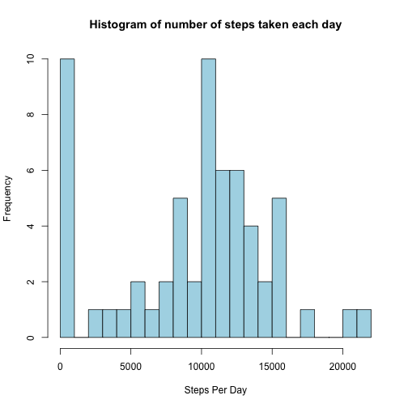
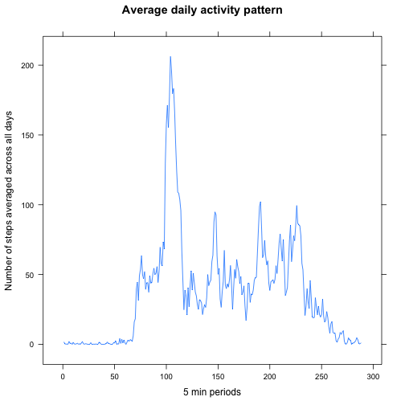
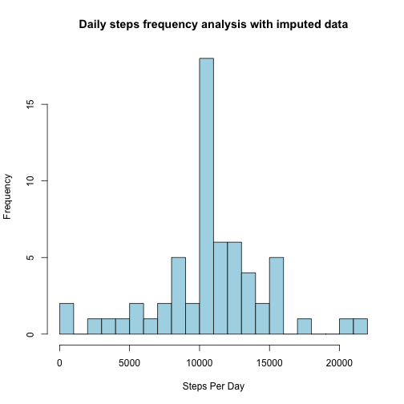
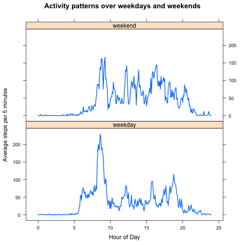

REPRODUCIBLE RESEARCH - Weekly Assessment 1  
========================================================================================================

## Loading and preprocessing the data:


```r
temp <- tempfile()
download.file("http://d396qusza40orc.cloudfront.net/repdata%2Fdata%2Factivity.zip",temp)
activitydata <- read.csv(unz(temp, "activity.csv"))
unlink(temp)
```

## What is mean total number of steps taken per day?


```r
dailySteps <- aggregate( activitydata$steps, list(activitydata$date),
                         function( x ){ sum( x, na.rm =TRUE ) } )
```

#### Histogram of the total number of steps taken each day:  


```r
hist( dailySteps$x, breaks = 16, col ='light blue',
      xlab = "Steps Per Day",
      main = "Histogram of number of steps taken each day" )
```

 

#### Mean total number of steps taken per day


```r
summary(dailySteps$x)
```

```
##    Min. 1st Qu.  Median    Mean 3rd Qu.    Max. 
##       0    6778   10400    9354   12810   21190
```

## What is the average daily activity pattern?


```r
intervalStepsAvg <- aggregate( activitydata$steps,
                            list(as.factor(activitydata$interval)),
                            'mean', na.rm =TRUE )
```
There are 288 five-minute periods in a day, and the result frame has 288 rows.

#### Time series plot

```r
library( 'lattice' )
xyplot(intervalStepsAvg$x ~ as.numeric(intervalStepsAvg$Group.1),
        type='l', lwd=1,xlab = '5 min periods', 
        ylab = 'Number of steps averaged across all days',
        main='Average daily activity pattern')
```

 

#### Analyzing the results

There are almost no steps in the early morning.

The 5-minute interval, which contains the maximum number of steps on an average across all the days in the dataset, is: 104


## Imputing missing values


#### Number of missing values

The missing step count is: 2304


#### Filling missing values in the dataset

We will need to convert time period data from hhmm format to minutes. We will use following function: 


```r
Interval2Minutes <- function( interval ){
  hours_part <- floor( interval / 100 )
  minutes_part <- interval - 100 * hours_part
  minutes <- hours_part * 60 + minutes_part
minutes
}
```

Strategy for filling missing values - Replace NA with mean for that 5-minute interval


```r
indexMissingSteps <- which(is.na(activitydata$steps))
intervalMissingSteps <- activitydata$interval[indexMissingSteps]
indexWantedSteps <- Interval2Minutes(intervalMissingSteps) / 5 + 1
wantedSteps <- as.integer(round(intervalStepsAvg$x[indexWantedSteps]))
activitydataImputed <- activitydata
activitydataImputed$steps[indexMissingSteps] <- wantedSteps
```
#### Summary of the new data set with the missing data filled in


```r
summary(activitydataImputed)
```

```
##      steps                date          interval     
##  Min.   :  0.00   2012-10-01:  288   Min.   :   0.0  
##  1st Qu.:  0.00   2012-10-02:  288   1st Qu.: 588.8  
##  Median :  0.00   2012-10-03:  288   Median :1177.5  
##  Mean   : 37.38   2012-10-04:  288   Mean   :1177.5  
##  3rd Qu.: 27.00   2012-10-05:  288   3rd Qu.:1766.2  
##  Max.   :806.00   2012-10-06:  288   Max.   :2355.0  
##                   (Other)   :15840
```

#### Histogram of the total number of steps taken each day


```r
dailyStepsImputed <- aggregate( activitydataImputed$steps,
                                list(activitydataImputed$date),
                                function( x ){ sum( x, na.rm =TRUE ) } )
hist( dailyStepsImputed$x, breaks = 16, col ='light blue',
      xlab = "Steps Per Day",
      main = "Daily steps frequency analysis with imputed data" )
```

 

```r
summary( dailyStepsImputed$x )
```

```
##    Min. 1st Qu.  Median    Mean 3rd Qu.    Max. 
##      41    9819   10760   10770   12810   21190
```

#### Comparing the Mean and Median with the values from the estimates from the first part of the assignment

Rewriting summary of the data from the first part of the assignment....

```r
summary(dailySteps$x)
```

```
##    Min. 1st Qu.  Median    Mean 3rd Qu.    Max. 
##       0    6778   10400    9354   12810   21190
```
As we can see, the mean and median values for imputed data differ from the estimates from the first part of the assignment. The mean and median for imputed data are higher.

## Are there differences in activity patterns between weekdays and weekends?

#### Creating a new factor variable in the dataset with two levels – “weekday” and “weekend” 

```r
activitydataImputed$dayType <-
  as.factor(
    ifelse( grepl('^S.+day$', 
            weekdays(as.Date(activitydataImputed$date))), 'weekend', 'weekday')
    )
```
Add an hours column to give the (fractional) hour of day


```r
intervalStepsAvgByType <- aggregate( activitydataImputed$steps, 
                                     list(as.factor(activitydata$interval),
                                     activitydataImputed$dayType), 'mean' )
intervalsHours <- seq(0,23.999,5/60)
intervalStepsAvgByType$hours <- c(intervalsHours,intervalsHours)
colnames(intervalStepsAvgByType) <- c('interval', 'dayType', 'steps', 'hours')
```
#### Panel plot  


```r
library( 'lattice' )
xyplot(intervalStepsAvgByType$steps ~ intervalStepsAvgByType$hours
        | intervalStepsAvgByType$dayType,
        type='l', lwd=2, layout=c(1,2),
        xlab = 'Hour of Day', ylab = 'Average steps per 5 minutes', 
        main='Activity patterns over weekdays and weekends')
```

 

#### Observations   

The individual being studied:  
- gets up later on weekends (kind of a soft-start)  
- has fewer steps on weekends  
- has more late-night activity on weekends  
